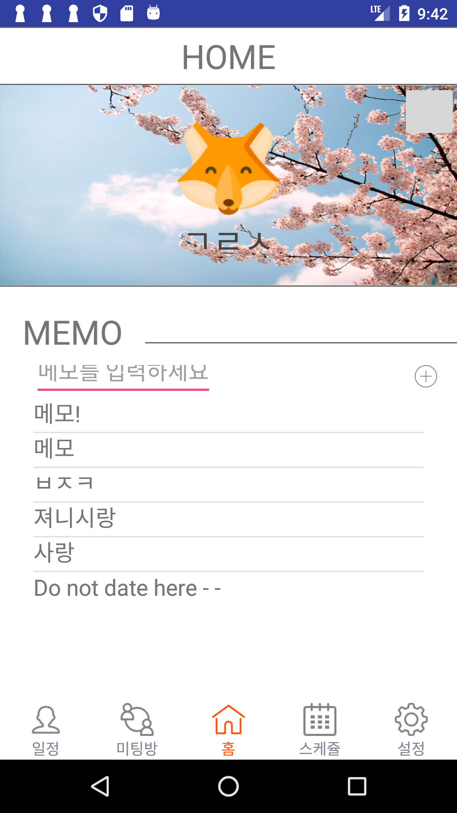
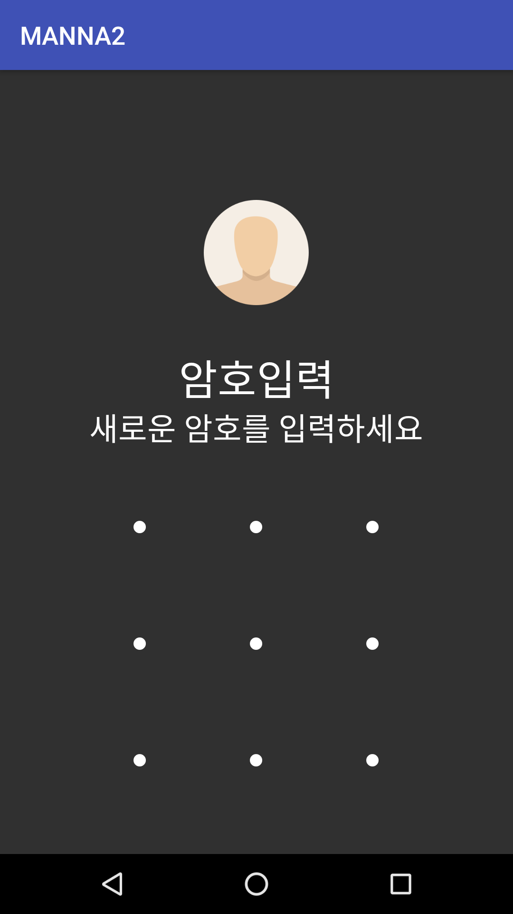
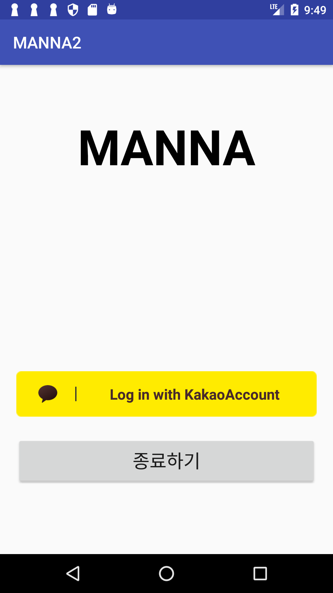
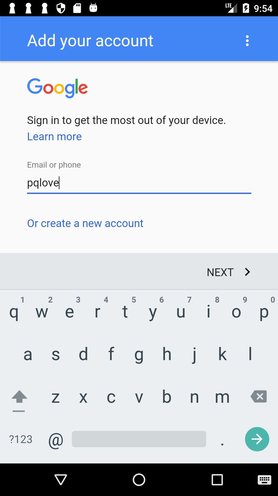
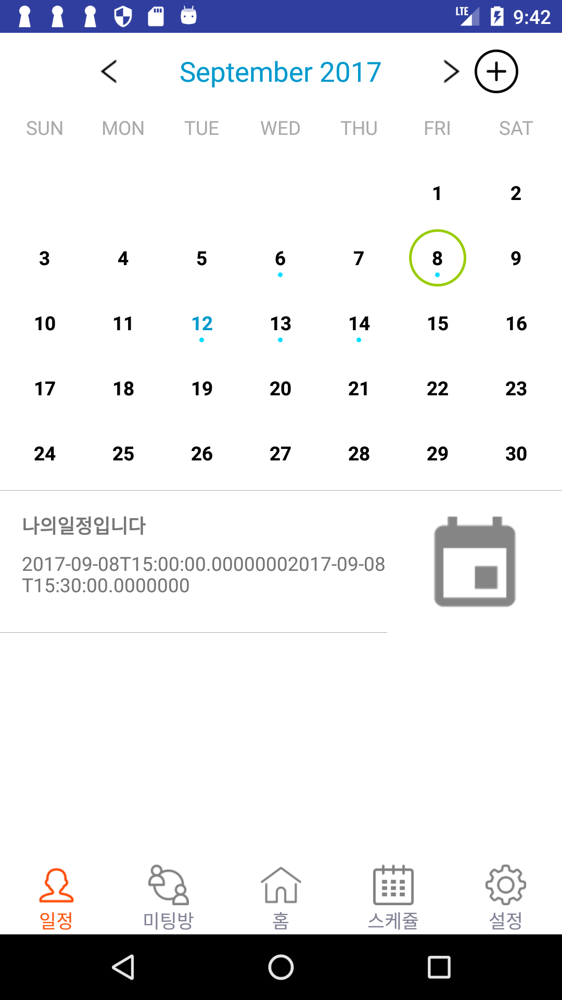
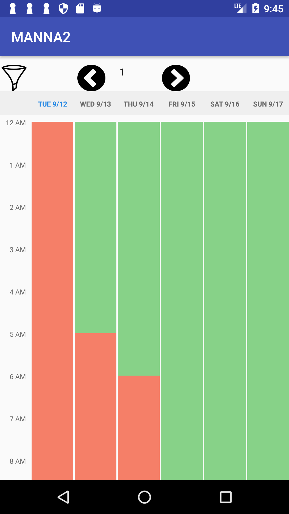

MANNA2
===========
- 기존 manna에서 캡스톤 디자인경진대회에 나가기 위해 더 세부적인 개발을 했음
- https://github.com/manna2/manna2  여기가 repository

## 기존 manna와 다른 기능
- 보안 기능 추가
  - 애플리케이션 패턴 잠금
- ui 개선(홈화면, 캘린더화면, 미팅화면 전체적으로)
- 카카오톡 친구 초대 기능
- 구글 캘린더에 자동으로 미팅 확정 일정 추가

## 개발 인원
- 한지연
- 윤나혜
- 김혜민

## 개발 기간
- 2017/03 - 2017/09 6개월 (MANNA1은 2017/03-2017/06, MANNA2는 2017/06-2017/09)

## 개요
- 안드로이드 애플리케이션
- 본인과 팀원들과의 스케줄을 자동 통합하여 최종적으로 팀 프로젝트를 위한 미팅 날짜와 시간을 한 눈에 보기 쉽게 시각화하여 보여주는 애플리케이션

## 소프트웨어 개발 환경
- 개발 툴: Android Studio 2.2.3
- 안드로이드 버전: kitkat 4.4
- 개발 환경: window 8.1 / mac sierra
- 언어: java 
- 하드웨어: galaxy S4 / galaxy grand max 

## 사용 API
- Google calendar API
- Microsoft Outlook calendar API
- Kakaotalk login API
- Google firebase API

## 실행 화면

1. 홈 화면

2. 잠금화면

2. 카카오톡 로그인 화면

2. 구글 연동 화면

3. 캘린더 화면

4. 팀원들과의 스케줄 통합한 화면

